# Exercicis de Creació de Processos

## Exercici 1

Quants processos es creen en executar el següent codi? *(Compteu el procés pare i els fills)*

```c
fork();
if (wait(st)>0)
    fork();
```

El primer `fork()` crea un fill. El pare com té un fill, executa el `wait()` i espera la notificació de canvi d'estat del fill. Això fa que el pare es bloquegi. El fill no té cap fill, per tant, la crida `wait()` retorna -1 i acaba. El pare, en canvi, segueix executant-se, el pid del fill és retornat per `wait()` i aleshores es crea un altre fill amb el segon `fork()`. Per tant, es creen 3 processos.

**Resolució visual**:

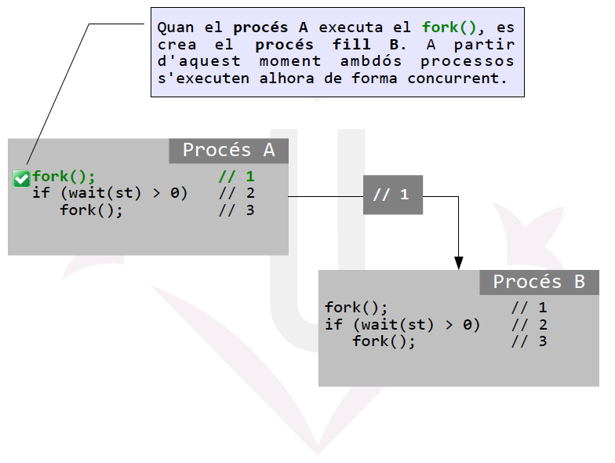


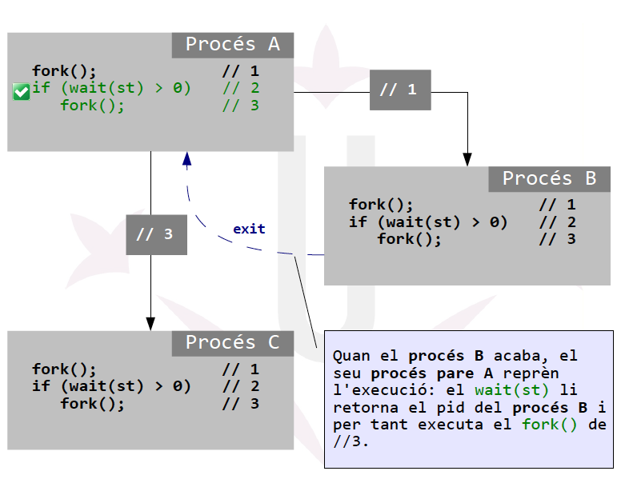

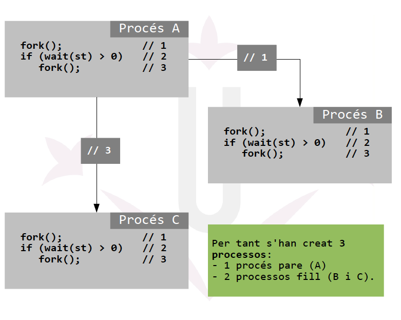

## Exercici 2

Quantes vegades s'imprimirà **OS**

```c
int main(){
    if(execel("bin/ls","ls",NULL) == -1){
    perror("execl");
    }
    printf("OS\n");
    return 0;
}
```

La crida a `execel()` substitueix el codi del procés actual pel codi del programa `ls`. Per tant, si `execel()` retorna, vol dir que ha fallat i s'executarà el codi que segueix a la crida a `execel()`. Per tant, s'imprimirà **OS** una vegada. Ara bé, si `execel()` no falla, no s'executarà el codi que segueix a la crida a `execel()` i no s'imprimirà **OS**. Per tant, la resposta és 0 o 1 en funció de l'estat de retorn de `execel()`.

## Exercici 3

Quantes vegades `wait(st)` retorna -1?

```c
id = fork();
wait(st);
if (id==0)
    fork();
wait(st);
```

El primer `fork()` crea un fill (F1). El pare executa el `wait()` i es bloqueja fins que el fill (F1) acaba. Aleshores, el fill executa `wait()` i com no té fills, retorna -1. El fill F1 executa el segon `fork()` i crea un altre fill (N1). El fill F1 executa el `wait()` i com no té fills, retorna -1. El pare segueix executant-se i executa el segon `wait()`. Com ja no té fills, retorna -1. Per tant, `wait(st)` retorna -1 tres vegades.

**Resolució visual**:

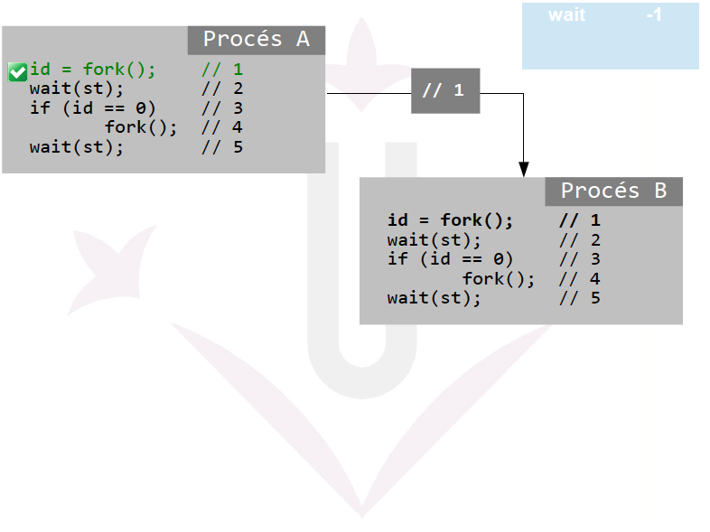


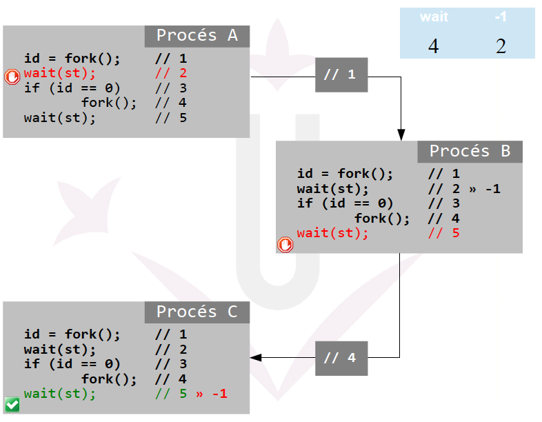

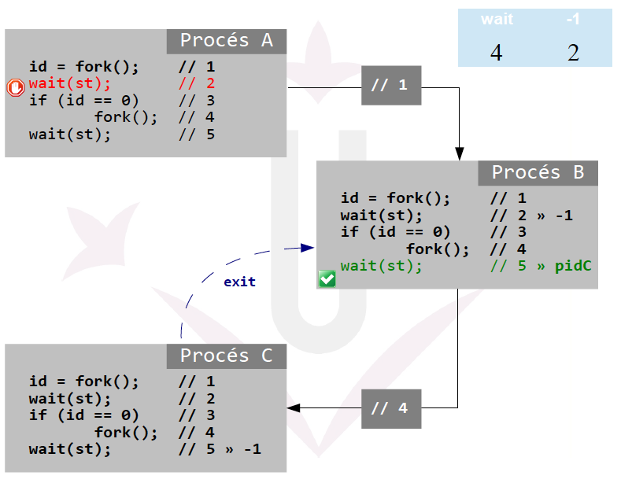

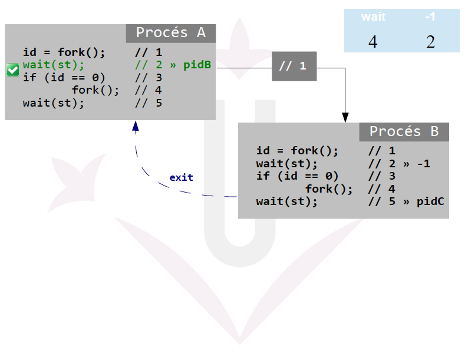

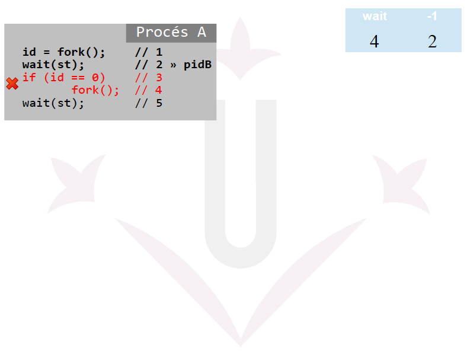


## Exercici 4

Quantes vegades `wait(st)` retorna -1?

```c
id = fork();
wait(st);
if (id!=0)
    fork();
wait(st);
```

El primer `fork()` crea un fill (F1). El pare executa el `wait()` i es bloqueja fins que el fill (F1) acaba. Aleshores, el fill F1 executa `wait()` i com no té fills, retorna -1.  El fill F1 executa el segon `wait()` i com no té fills, retorna -1. F1 acaba i desbloqueja el procés pare. El pare executa el segon `fork()` i crea un altre fill F2. El pare executarà el segon `wait()` i esperarà a que F2 acabi. Aleshores, F2 executarà el `wait()` i com no té fills, retornarà -1 i el fill F2 acabarà. Un cop F2 acaba, el pare es desbloquejarà i acabarà. Per tant, `wait(st)` retorna -1 tres vegades.

**Resolució visual**:

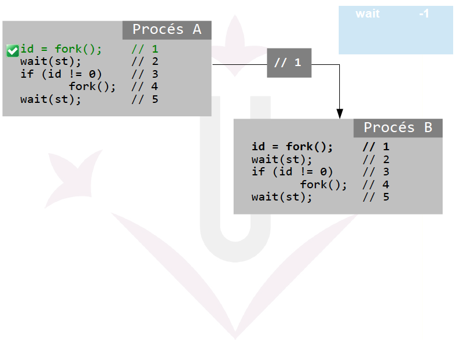


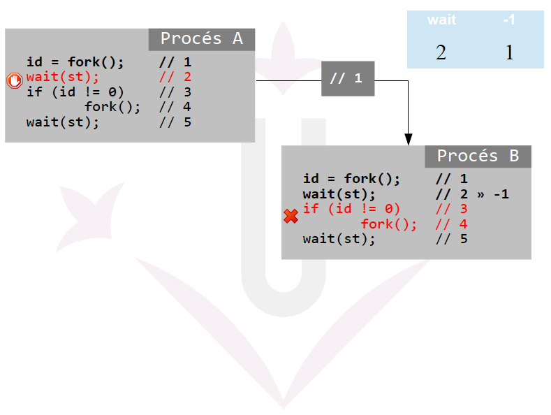

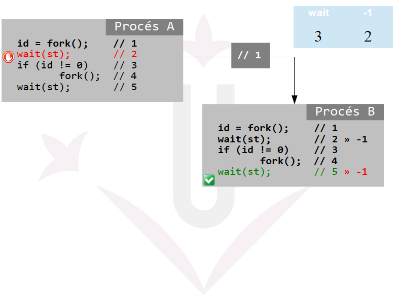

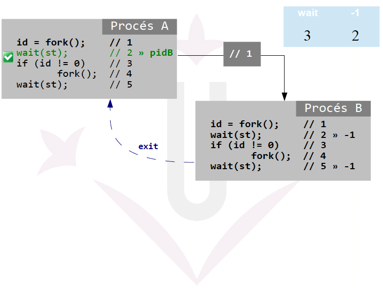


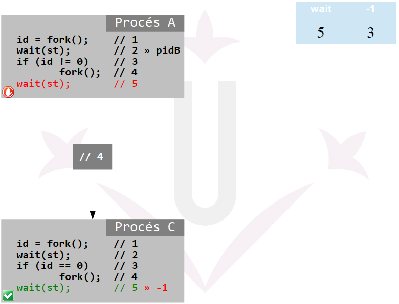


## Exercici 5

En quin ordre surtiran els missatges a `stdout`?

- Primer A i despres B o C
- Primer A, després B i després C
- Primer A, després C i després B
- A, B i C en qualsevol ordre

```c
int main()
{
    switch(fork()){
        case 0: printf("A");
                switch(fork()){
                    case 0: printf("B");exit(0);
                    default: switch(fork()){
                        case 0: printf("C");exit(0);
                        default: wait(&st);exit(0);
                    }            
                wait(&st);
                }
        default: wait(&st); exit(0);
    }
}
```

El primer `fork()` crea un fill (F1). El pare fa un `wait()` i es bloqueja fins que F1 acabi. El fill F1 crea un fill al segon `fork()` (N1). En aquest cas, el N1 pot executar el `printf("B")` i acabar o el fill (F1) pot executar un altre `fork()` i crear un altre fill (N2). El F1 llavors es bloqueja `wait()` fins que N1 o N2 acabin. Alternativament, N2 pot executar el `printf("C")` i acabar. Per tant,no es pot determinar l'ordre en què sortiran els missatges B i C a `stdout`. Un cop N1 o N2 acabin, el F1 es desbloquejarà i executarà el segon `wait()` i acabarà (F1). Noteu, que el segon fill N1,N2 no té pare on retornar i es queda com a procés zombi. Al acabar F1, el i acabarà. El pare executarà el segon `wait()` i acabarà. Per tant, el missatge que sortirà a `stdout` serà **ABC** o **ACB**.

**Resolució visual**:

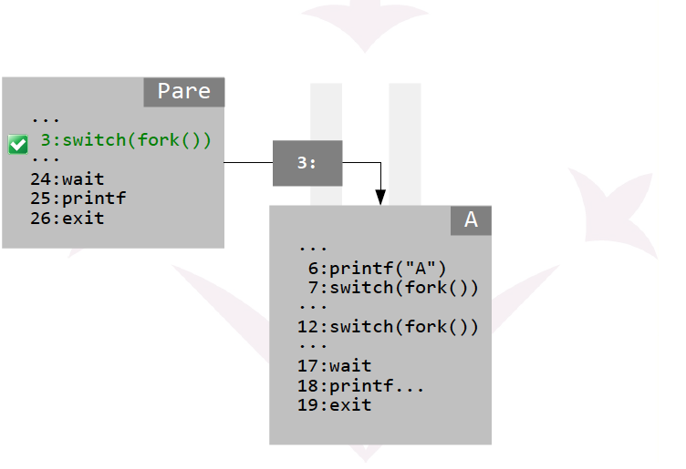

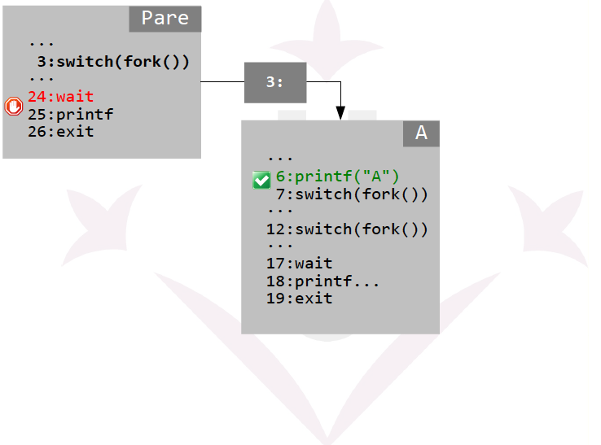


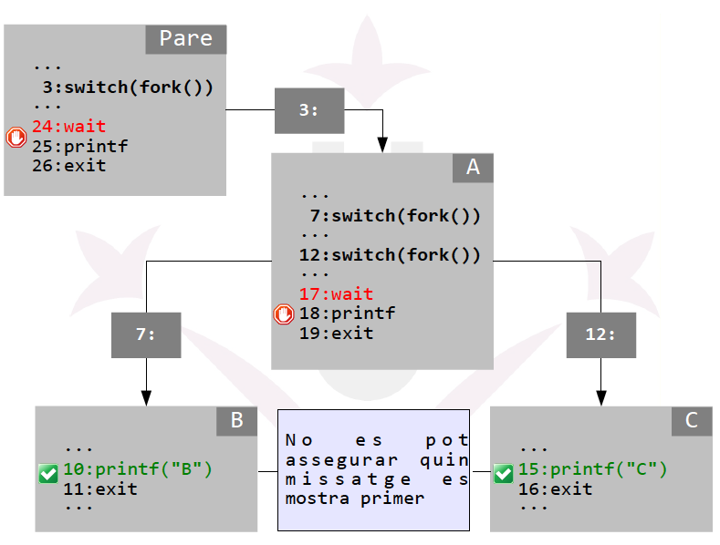

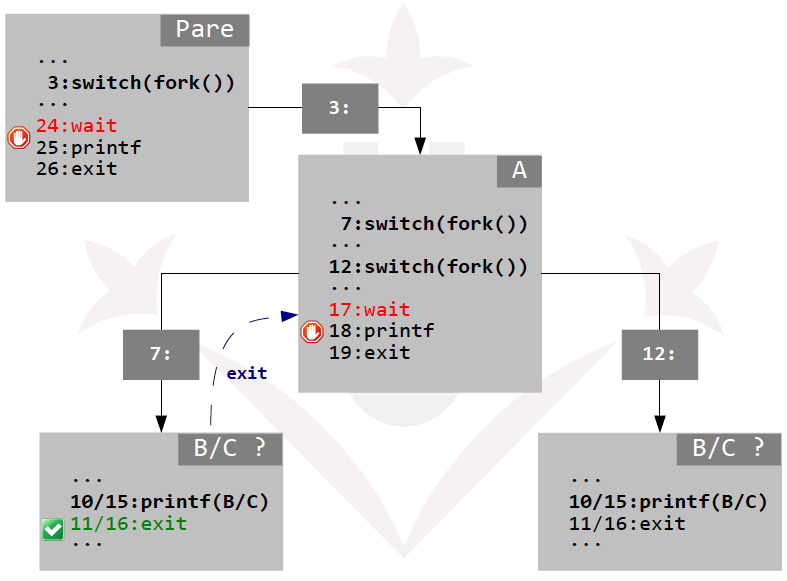

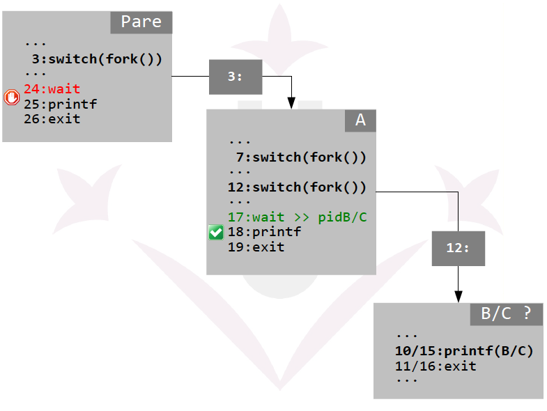

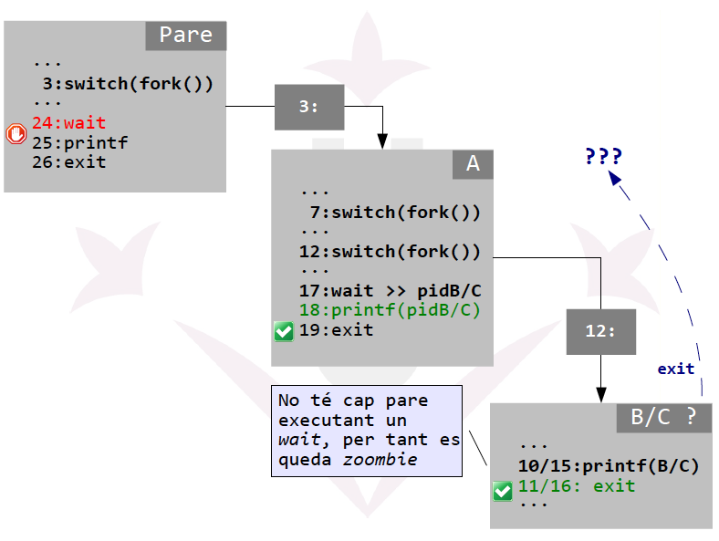


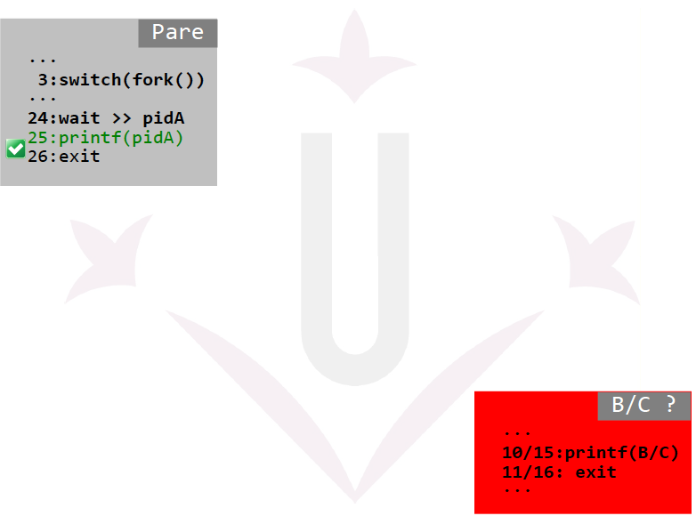


Per solucionar, el problema dels processos zombis, es pot afegir un `wait(&st)` abans de fer `exit(0)` en F1. Així, F1 esperarà els dos fills N1 i N2 abans de finalitzar.

```c
int main()
{
    switch(fork()){
        case 0: printf("A");
                switch(fork()){
                    case 0: printf("B");exit(0);
                    default: switch(fork()){
                        case 0: printf("C");exit(0);
                        default: wait(&st);wait(&st);exit(0);
                    }            
                wait(&st);
                }
        default: wait(&st); exit(0);
    }
}
```

Per garantir un ordre determinat per exemple `ABC`, es pot afegir un `wait(&st)` abans de fer `exit(0)` en N1 i N2. Així, F1 esperarà que N1 o N2 acabin abans de finalitzar.

```c
int main()
{
    switch(fork()){
        case 0: printf("A");
                switch(fork()){
                    case 0: printf("B");exit(0);
                    default:
                        wait(&st); 
                        switch(fork()){
                        case 0: printf("C");exit(0);
                        default: wait(&st);exit(0);
                    }            
                wait(&st);
                }
        default: wait(&st); exit(0);
    }
}
```

Per garantir el missatge `ACB`, es pot pausar N1, esperar per la finalització de N2 i desperar N1.

## Exercici 6

Indiqueu quin és el resultat de l'execució del següent codi. Nombre de processos creats, parantiu, informació de `stdout`, procés zombi, etc.

```c
#define N 10
int main()
{
    int pid = getpid();
    for (int x=0; x<N x++)
    {
        switch(fork())
        {
            case 0:
                if ( (pid%2) == 0 )
                    printf("Pid Fill: %d\n", getpid());
                    exit(0);
                break;
        
            default:
                if ( (pid%2) !== 0 )
                    exit(0);
                break;
        }
    }
    wait(NULL);
    exit(0);
}
```

El comportament del codi depèn de si el pid del procés pare és parell o senar:

- **Cas parell**:
  
  - El procés pare crea 10 fills, un a cada iteració del bucle.
  - Els fills acaben immediatament amb la crida a `exit(0)`.
  - El pare, no fa cap `wait()`, per tant, els fills es converteixen en processos zombis.
  - El pare únicament fa un `wait()` al final del bucle, per tant, el procés pare rebra la notificació de la finalització d'un fill i acabarà.
  - Tots els processos fills -1 acaben en estat zombi i orfes fins que init els recull.

  > **Nota**:
  >
  > Tot i que els fills acabin sense que el pare faci cap `wait()`, quan el pare executi `wait(NULL)`, el sistema operatiu recollirà un SIGCHLD d'un dels fills que previament ha acabat i aquest no es convertirà en procés zombi.

- **Cas senar**:

  - En aquest cas, el pare acaba després de crear el primer fill.
  - Cada iteració del bucle, el fill crea un fill i acaba.
  - Per tant, en aquest cas, es creen 10 generacions de fills.
  - Cap pare fa cap `wait()`, per tant, tots els fills es converteixen en processos zombis.
  - El últim fill executarà el `wait()` i com no té fills, retornarà -1 i acabarà.
  - Tots els processos fills acaben en estat zombi i orfes fins que init els recull.
